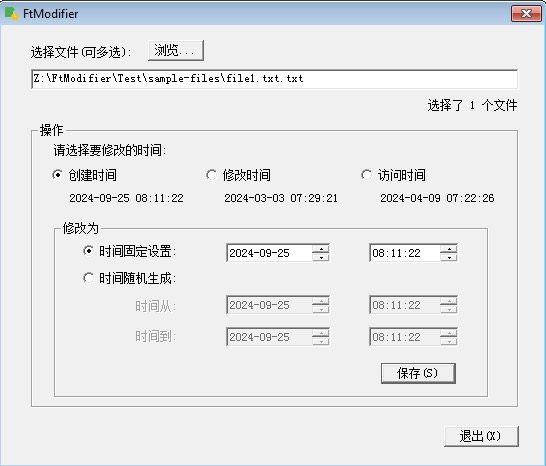

## Overview
This is a simple win32 utility program used to modify the creation time, last write time, or last access time of file. 

Currently the display language is simplified Chinese.

It is a little hobby project originally developed in about 2003. 

## How to Use:
Please just click the FtModifier.exe in Windows to open the program. The UI is quite intuitive, you can select one file or multiple files, then choose which time you want to change. You can set the new value to either a fixed date time or a random date time between a certain range.

## Bug to Fix:
The creation time cannot be saved as the edited value, it always turns to the instant at which the file was saved.

## Tests
The program was tested under Window XP, Windows 2003, Window 7, Windows 2008, and Windows 10. It should also work under Windows 11.

## Develop
Developed under Visual V++ 6.0 with MFC support. Any pull requests are welcome.
